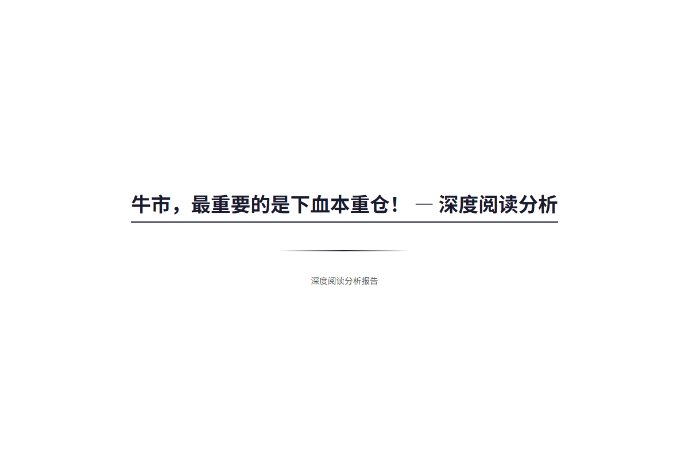
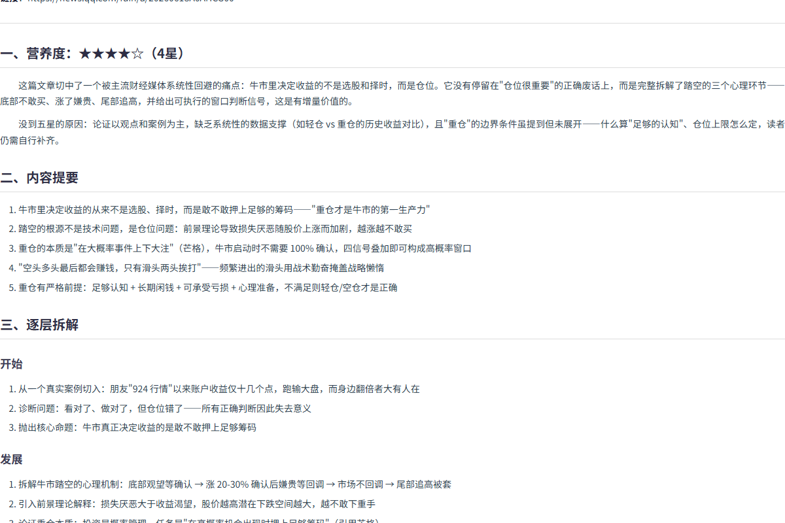

# 深度文章分析（深度阅读分析大师）

> 基于唐嘉序的 WorkBuddy 分析公众号文章完整方法论，扩展适配所有类型网页内容的系统化深度分析 Skill。
> 一句话：**先帮你汲取文章的洞见，再帮你检验洞见的可靠性——汲取在前，验证在后。**

   

---

## 📸 效果预览

| 封面页 | 正文（营养度 / 提要 / 逐层拆解） |
|:---:|:---:|
|  |  |

> 完整长图与 PDF 见 [`demo/`](demo/) 目录。

---

## 这是什么

一个 WorkBuddy（AI 助手）技能包。给它一个网页链接或一段文本，它会自动完成 10 个板块的结构化深度分析，并一次性输出 4 种格式（Markdown / HTML / Word / PDF）。

**不是简单的"总结器"**，而是"学习伙伴 + 验证者"：
- **汲取**：营养度评级、逐层拆解、核心洞见、金句、术语、总结、反思、行动
- **验证**：关键数据联网交叉核对（✅/⚠️/⚡ 标注）、论证逻辑审视、反共识挖掘、视角补全

---

## 🎯 功能特性

| 能力 | 说明 |
|------|------|
| 🌐 全类型内容适配 | 公众号、新闻、博客、研报、知乎、论坛、播客文字稿，自动识别来源并调整分析侧重 |
| 🎯 双模式 | 「分析审查模式」（10 板块）与「梳理总结模式」（学习吸收）一键切换 |
| 📊 三档深度 | `quick`（快速精炼）/ `standard`（默认标准）/ `deep`（深度+思维链） |
| 💰 财经专项 | 内置财经文章专项检查：数据核查、投资逻辑审查、OEQ 框架、前提验证（不荐股） |
| 🔍 数据联网验证 | 关键数据 WebSearch 交叉核对，用 ✅/⚠️/⚡ 标注 |
| ⭐ 营养度评级 | 1-5 星量化文章增量价值，≤2 星自动缩略执行 |
| 📄 四格式输出 | `.md` + `.html` + `.docx` + `.pdf` 一次生成 |
| 🧠 认知偏差审查 | 6 条认知偏差检查清单（references/）用于逻辑审查 |
| 🔄 双文对比 | 支持两篇文章观点对比分析（模板 4） |

---

## 📂 目录结构

```
深度文章分析/
├── SKILL.md                      # 技能主文件（触发条件、参数、模板、流程、输出规范）
├── references/
│   └── cognitive-biases.md       # 六条认知偏差检查清单（逻辑审查阶段使用）
├── scripts/
│   ├── md2all.py                 # MD → HTML → PDF 转换（Playwright 渲染）
│   └── md2docx.py                # MD → DOCX 转换（Word/WPS 兼容样式）
├── demo/                         # 真实运行产物示例（README 截图素材）
│   ├── 2026-08-03_牛市最重要的是下血本重仓.md
│   ├── 2026-08-03_牛市最重要的是下血本重仓.html
│   ├── 2026-08-03_牛市最重要的是下血本重仓.pdf
│   ├── demo-report-cover.png     # 封面页截图
│   ├── demo-report-content.png   # 正文截图
│   ├── demo-report-full.png      # 全页长图
│   └── screenshot.py             # 截图复现脚本
├── README.md                     # 本文件
└── LICENSE                       # MIT 协议
```

---

## 🚀 快速上手

### 1. 安装

将本仓库放入 WorkBuddy 的 skills 目录（用户级或项目级均可）：

```bash
# 用户级（所有项目可用，推荐）
cp -r 深度文章分析 ~/.workbuddy/skills/

# 或项目级
cp -r 深度文章分析 {你的项目}/.workbuddy/skills/
```

**依赖**（用于四格式转换，Python 环境）：

```bash
pip install markdown python-docx
# PDF 渲染需要 Playwright + Chromium
pip install playwright
playwright install chromium
```

> 没有 Python 环境也不影响核心分析功能——只是少生成 .docx / .pdf 两种格式，.md 和 .html 仍可正常输出。

### 2. 使用

在 WorkBuddy 对话中触发：

```
/深度文章分析 https://mp.weixin.qq.com/s/xxxx     # 分析公众号文章
/深度文章分析 https://36kr.com/p/xxxx depth=deep   # 深度模式
/深度文章分析 https://xxx.com/report.pdf topic=finance  # 财经研报专项
```

也可以直接把文章全文粘贴给 AI 触发（无链接场景）。

### 3. 参数

| 参数 | 必填 | 默认值 | 取值 | 说明 |
|------|:---:|:---:|------|------|
| `url` | ✅ | - | 链接或全文文本 | 待分析内容 |
| `depth` | ❌ | `standard` | `quick` / `standard` / `deep` | 分析深度 |
| `topic` | ❌ | `auto` | `auto` / `finance` / `tech` / `society` / `general` | 文章主题 |

`topic=auto` 时自动识别：出现「营收/毛利率/PE/净利润/估值/股价」→ finance；「API/架构/模型/算法」→ tech；「政策/社会/教育/医疗」→ society。

---

## 📚 分析流程

```
第零步  内容抓取 + 来源识别 + 完整性检查（截断检测、长度自检）
第一步  营养度评级（1-5星）+ 元数据标注 + 标签提取
第二步  逐层拆解（开始→发展→结论，各 ≥3 要点）
第三步  核心洞见（≥5条）+ 金句（≥5句）+ 术语（≥5个）+ 数据联网验证（≤10条）
第四步  反共识挖掘（≥5个）+ 总结归纳（≥5条）+ 读后反思（≥3问）+ 读后行动（1-3条）
第五步  四格式输出（MD → HTML → DOCX → PDF），保存到 article-analysis\ 子目录
```

### 模板选择矩阵（自动决策）

| depth | topic | 执行模板 |
|-------|-------|---------|
| `quick` | 任意 | 模板1：快速精炼 |
| `standard` | auto/general | 模板5：梳理总结（学习吸收） |
| `standard` | finance | 模板5 + 模板3：梳理 + 财经专项 |
| `deep` | auto/general | 模板5 + 思维链 |
| `deep` | finance | 模板5 + 模板3 + 思维链 |
| 两篇文章 | - | 模板4：观点对比 |
| 用户明确要求「分析/核查」 | - | 模板2：10板块全量审查 |

### 输出报告 10 板块结构

1. 营养度评级（含评级理由）
2. 内容提要（≥3 条，非流水账）
3. 逐层拆解（开始/发展/结论）
4. 核心洞见（≥5 条，主张+亮点+验证注脚三段融合）
5. 反共识挖掘（≥5 个，不硬凑）
6. 金句（≥5 句原文引用）
7. 关键术语（≥5 个，一句话解释）
8. 总结归纳（≥5 条）
9. 读后反思（≥3 个问题）
10. 读后行动（1-3 条可落地建议）

> 营养度 ≤2 星时自动缩略（板块 2/3/4/7 各减半，跳过 5/6），不做无意义的过度分析。

### 数据验证标注

| 标注 | 含义 | 判定标准 |
|:--:|------|------|
| ✅ | 真实 | 2+ 独立可靠来源一致确认 |
| ❌ | 虚假 | 2+ 独立可靠来源一致反驳 |
| ⚡ | 数据偏差 | 搜到但偏差 > 20% |
| ⚠️ | 无法验证 | ≤1 个来源或来源不可靠 |
| 🔍 | 截断风险 | 抓取内容疑似不完整 |

---

## 📄 四格式输出

所有报告自动保存到当时工作区 `article-analysis\` 子目录，命名 `YYYY-MM-DD_{清洗后标题}`：

| 格式 | 生成方式 | 适用场景 |
|------|---------|---------|
| `.md` | 主报告 | 源文件、二次编辑、上传知识库 |
| `.html` | md2all.py（完整 CSS 排版，含封面页） | 浏览器直接打开、分享 |
| `.docx` | md2docx.py（主题色标题/斑马纹表格/代码块） | Word/WPS 编辑、微信发送 |
| `.pdf` | md2all.py → Playwright 渲染（与 HTML 排版一致） | 打印、存档、正式交付 |

---

## 📊 查看示例

本仓库 [`demo/`](demo/) 目录包含一次真实运行产物（输入：公众号文章《牛市，最重要的是下血本重仓！》— 星图金融研究院；输出：standard + 财经专项模式全套报告）：

- `demo/2026-08-03_牛市最重要的是下血本重仓.md` — 完整 10 板块 Markdown 报告
- `demo/2026-08-03_牛市最重要的是下血本重仓.html` — 浏览器可打开的排版版
- `demo/2026-08-03_牛市最重要的是下血本重仓.pdf` — 打印版（约 1.1 MB，与 HTML 排版一致）
- `demo/demo-report-cover.png` — 封面页截图
- `demo/demo-report-content.png` — 正文（营养度/提要/逐层拆解）截图

> 截图均由 `demo/screenshot.py`（Playwright 渲染）生成，可直接复现。

## ⚙️ 可选集成：IMA 知识库上传

报告生成后支持自动上传至 IMA 知识库（需自行配置 `~/.config/ima/client_id` 与 `api_key`，并填入你的知识库 ID / 文件夹 ID）。未配置凭证时自动跳过此功能，不影响核心分析。

## 🎯 设计原则

1. **不无脑总结，做结构化提取**：复述原文是浪费能力；把论点、论据、逻辑链拆开摆上桌，让验证有靶子。
2. **打破讨好语气**：直接坦诚地指出问题，不"过度礼貌"。
3. **搜索不是搜一次**：关键数据至少 2-3 个来源交叉验证。
4. **区分信息与框架**：信息汇总型内容价值递减，分析框架才有长期价值。
5. **剥掉文笔糖衣**：忽略文笔和叙事技巧，只分析实质内容。
6. **不荐股**：财经模式下仅做分析和风险提示，不输出买卖建议。

---

## 📈 更新日志

### v1.0（2026-08-03）
- ✅ 完整的 10 板块结构化分析
- ✅ 双模式（分析审查 / 梳理总结）+ 三档深度（quick / standard / deep）
- ✅ 财经文章专项模式（数据核查 / OEQ 框架 / 前提验证）
- ✅ 四格式输出（MD / HTML / DOCX / PDF）
- ✅ 6 条认知偏差检查清单
- ✅ 可选 IMA 知识库集成

---

## 🙏 致谢

- **方法论**：唐嘉序的 WorkBuddy 分析公众号文章完整方法论
- **认知偏差清单**：唐嘉序日常积累的六条认知偏差
- **参考仓库**：[luokeychen/awesome-claude-skills](https://github.com/luokeychen/awesome-claude-skills)（Fleury 如宝）— README 写法参考

## 📄 License

MIT License
